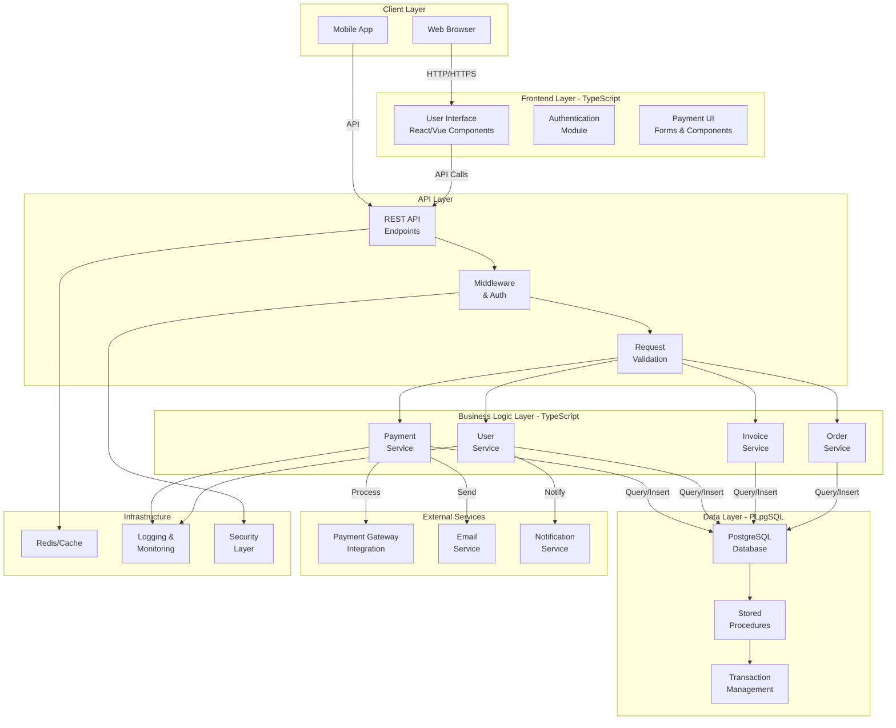

# PSAistudio Payment Website SaaS - Architecture Overview

## System Architecture

## Technology Stack

| Layer | Technology | Language |
|-------|-----------|----------|
| **Frontend** | React/Vue, TypeScript, HTML/CSS | TypeScript (91%) |
| **Backend** | Node.js/Express, TypeScript | TypeScript (91%) |
| **Database** | PostgreSQL | PLpgSQL (8.3%) |
| **Caching** | Redis | - |
| **API** | REST API | TypeScript |
| **Authentication** | JWT/OAuth | TypeScript |
| **Utilities** | Other Dependencies | Other (0.7%) |

## Key Components

### Frontend Layer (TypeScript)
- User interface for payment processing
- Authentication module for user management
- Payment forms and transaction displays
- Real-time order tracking

### Backend Layer (TypeScript)
- **Payment Service**: Handles payment processing and gateway integration
- **User Service**: Manages user accounts and profiles
- **Invoice Service**: Generates and manages invoices
- **Order Service**: Handles order creation and status management

### Database Layer (PostgreSQL with PLpgSQL)
- Transaction management with ACID compliance
- Stored procedures for complex operations
- Data integrity and consistency
- Secure payment data storage

### External Integrations
- Payment gateway for credit/debit card processing
- Email service for transaction notifications
- Notification service for real-time updates

### Infrastructure
- Redis for caching and session management
- Logging and monitoring systems
- Security layer for data protection

## Data Flow

1. **User Login**: Client → Authentication Module → User Service → PostgreSQL
2. **Payment Creation**: Payment UI → Payment Service → Payment Gateway → Database
3. **Invoice Generation**: Order Service → Invoice Service → Email Service → User
4. **Transaction Confirmation**: Payment Gateway → Payment Service → Notification Service → User

---

*Last Updated: 2026-05-21*
